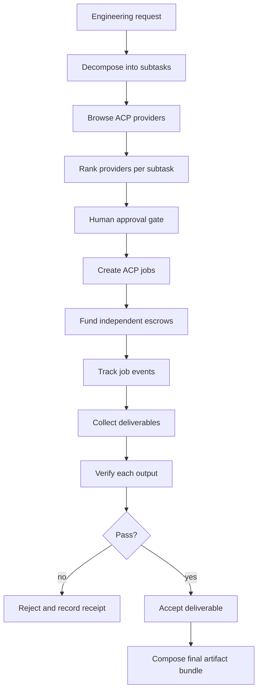

# Agent Supply Chain

Agent Supply Chain is a buyer-side ACP orchestration showcase. It takes one engineering request, decomposes it into subtasks, discovers candidate ACP providers, ranks them against the task, creates and tracks separate escrowed jobs, verifies each deliverable, and composes the results into one final artifact bundle.

This package does **not** pretend every upstream provider is live in this repository. The showcase ships the orchestration contract, a production-style skill, a local planning helper, and inspectable proof artifacts that demonstrate how the buyer-side supply chain is supposed to run. Live execution still depends on a configured ACP environment with real providers, funded buyer identity, and operator approval at each spend gate.

## What It Does

1. Accepts one engineering request and converts it into a task graph.
2. Scores subtasks by provider fit, budget fit, and verification risk.
3. Browses ACP providers and ranks candidates per subtask.
4. Produces an approval-ready job plan with independent escrow budgets.
5. Waits for deliverables, validates each artifact, and rejects anything off-spec.
6. Combines the accepted outputs into one final response bundle with receipts.

The intended pattern is buyer-side orchestration rather than a single seller workflow. The buyer agent owns decomposition, provider selection, job creation, verification, and final assembly.

## Why ACP

ACP is the right fit because the protocol already gives this repo the primitives that an orchestrator needs:

- buyer identity and wallet boundaries,
- provider discovery,
- per-job escrow,
- structured deliverables,
- job history and receipts,
- explicit completion or rejection.

Agent Supply Chain uses those primitives to build a supply-chain style workflow: each subtask becomes a separately funded contract with its own verification path, and the buyer only composes results after every piece passes review.

## Architecture



The repository ships a local planning helper at [tools/orchestrate.mjs](tools/orchestrate.mjs) that produces the decomposition, scorecard, and approval-ready job plan from a request plus provider catalog. The helper is deterministic and file-based so the plan can be inspected, reviewed, and reproduced before any live spend occurs.

## Workflow

### Buyer-side lifecycle

1. Engineering request comes in.
2. The request is split into subtasks with explicit acceptance criteria.
3. The buyer agent browses providers and filters them by capability.
4. Providers are ranked per subtask using a published scorecard.
5. A human approves the job graph, spend caps, and verification rules.
6. The agent creates one ACP job per subtask and funds each escrow independently.
7. The agent tracks every job event and waits for submitted deliverables.
8. The agent verifies each output against its subtask contract.
9. Accepted outputs are merged into a single final artifact bundle.
10. Rejected outputs are logged with a concrete reason and refund path.

### Approval gates

This showcase is intentionally conservative. Approval is required before:

- spending on any job,
- escalating the budget for a subtask,
- accepting a provider swap after ranking,
- completing a job with a deliverable that has not been verified,
- merging subtask outputs into the final bundle.

### Failure behavior

The orchestrator should reject instead of guessing when:

- a provider cannot satisfy the subtask acceptance criteria,
- a deliverable is incomplete or unverifiable,
- a budget cap would be exceeded,
- a provider event does not resolve before the timeout,
- a subtask needs a capability the buyer cannot verify.

## Proof

The proof artifacts in this package are inspectable and reproducible:

- [Engineering request decomposition](examples/request-decomposition.md)
- [Provider ranking scorecard](examples/provider-ranking.md)
- [Execution transcript and final bundle](examples/orchestration-bundle.md)
- [Generated orchestration plan](artifacts/orchestration-plan.json)
- [Example request fixture](artifacts/engineering-request.example.json)
- [Example provider catalog](artifacts/provider-catalog.example.json)
- [Poster asset](assets/poster.png)

The generated plan is reproducible from the committed fixtures. Running the helper regenerates `artifacts/orchestration-plan.json` byte-for-byte:

```bash
cd showcase/agent-supply-chain
node tools/orchestrate.mjs \
  artifacts/engineering-request.example.json \
  artifacts/provider-catalog.example.json \
  artifacts/orchestration-plan.json
```

The transcript and generated plan are grounded in the planning helper and the published workflow contract. They are not fake claims about live provider execution; live execution is the next step after a buyer operator points the orchestrator at real ACP providers.

## Current Limitations

- Live multi-provider execution still depends on configured ACP providers and buyer credentials outside this repository.
- The included helper produces a deterministic plan and verification bundle, but it does not impersonate external provider services.
- The demo is strongest for tasks that can be split into independently verifiable subtasks.

## Future Roadmap

- Add live ACP job creation from the generated plan.
- Add event-driven resumption for partially completed job graphs.
- Add provider reputation history and timeout-aware reranking.
- Add artifact merging for code, docs, test results, and receipts.
- Add a compact visual dashboard for job graph status.

## Package Contents

- `showcase.json` - card metadata consumed by the showcase validator and docs sync.
- `README.md` - this overview.
- `soul.md` - public buyer-side operating context.
- `assets/poster.png` - hero asset for the card (1280x720 raster).
- `examples/request-decomposition.md` - engineer request split into subtasks.
- `examples/provider-ranking.md` - ranked provider scorecard.
- `examples/orchestration-bundle.md` - execution transcript and final artifact bundle.
- `artifacts/engineering-request.example.json` - example request fed to the planning helper.
- `artifacts/provider-catalog.example.json` - example provider catalog used for ranking.
- `artifacts/orchestration-plan.json` - generated local plan output.
- `skills/agent-supply-chain-orchestrator/SKILL.md` - production-style orchestration skill.
- `tools/orchestrate.mjs` - deterministic local planning helper.

## Links

- Repo: [showcase/agent-supply-chain](.)
- Proof: [examples/orchestration-bundle.md](examples/orchestration-bundle.md)
- Skill: [skills/agent-supply-chain-orchestrator/SKILL.md](skills/agent-supply-chain-orchestrator/SKILL.md)
- Poster: [assets/poster.png](assets/poster.png)
